# Database Design & Entity Relationship (ER) Diagram

This document contains a comprehensive database design overview, including a detailed **Entity Relationship (ER) Diagram** using Mermaid.js and a complete **Data Dictionary** for all 26 models in the application.

---

## 1. Entity Relationship (ER) Diagram

Below is the ER diagram representing all models and their relationships.

```mermaid
erDiagram
    %% ==========================================
    %% RELATIONSHIPS
    %% ==========================================

    %% UserProfile Relations
    UserProfile ||--o{ Stamp : "from_Stamp_user"
    UserProfile ||--o{ Usertour : "from_Usertour_user"
    UserProfile ||--o{ Visithistory : "from_Visithistory_user"
    UserProfile ||--o{ Bookmark : "from_Bookmark_user"
    UserProfile ||--o{ Analytic : "from_Analytic_user"

    %% Region Relations
    Region ||--o{ Monument : "featuredmonument"

    %% Shape Relations
    Shape ||--o{ Monument : "from_Monument_shape"

    %% Theme and Subtheme Relations
    Theme }|--|{ Subtheme : "Subtheme_theme"
    Theme }|--|{ Monument : "Monument_theme"
    Subtheme }|--|{ Monument : "Monument_subtheme"

    %% Place and Category Relations
    Placecategory ||--o{ Place : "places"
    Place }|--|{ Monument : "Monument_nearbyservices"

    %% TravelType and Tourpoint Relations
    Traveltype ||--o{ Tourpoint : "from_Tourpoint_traveltype"

    %% Tour Relations
    Tour ||--o{ Tourpoint : "tourpoint"
    Tour ||--o{ Usertour : "from_Usertour_tour"
    Tour ||--o{ Visithistory : "from_Visithistory_tour"
    Tour ||--o{ Bookmark : "from_Bookmark_tour"
    Tour }|--|{ Video : "Tour_videos"
    Tour }|--|{ About : "About_relatedtours"

    %% Monument Relations
    Monument ||--o{ Tourpoint : "from_Tourpoint_monument"
    Monument ||--o{ Stamp : "from_Stamp_monument"
    Monument ||--o{ Visithistory : "from_Visithistory_monument"
    Monument ||--o{ Bookmark : "from_Bookmark_monument"
    Monument ||--o{ Event : "from_Event_relatedmonument"
    Monument ||--o{ Galleryimage : "gallery"
    Monument ||--o{ Galleryimage : "artemplates"
    Monument }|--|{ StagedImage : "stagedImages"
    Monument }|--|{ StagedImage : "stagedARTemplates"
    Monument }|--|{ Video : "Monument_videos"
    Monument }|--|{ Monument : "nearbymonuments"

    %% Usertour Relations
    Usertour ||--o{ Stamp : "from_Stamp_usertour"

    %% ==========================================
    %% ENTITY FIELDS
    %% ==========================================

    User {
        string id PK
        string firstname
        string lastname
        string email
        string password
        boolean isAdmin
    }

    UserProfile {
        string id PK
        string name
        UserProfileStateType state
        string gender
        string agegroup
        string nationality
        string email
        BigInt phoneNumber
        Json image
        string firebaseUserId
        UserProfileAccountType account
        string country
        boolean special
        string pinCode
        string token
    }

    Region {
        string id PK
        string name
        string slug
        string title_en
        string title_ja
        string state
        Json image
        Json mapimage
        Json content_brief_en
        Json content_brief_ja
        Json content_extended_en
        Json content_extended_ja
        string content_brief_en_text
        string content_brief_ja_text
        string content_extended_en_text
        string content_extended_ja_text
        Json location
    }

    Shape {
        string id PK
        string name
        string title_en
        string title_ja
        string state
        Json icon
        Json content_brief_en
        Json content_brief_ja
        Json content_extended_en
        Json content_extended_ja
    }

    Theme {
        string id PK
        string name
        string slug
        string title_en
        string title_ja
        string state
        Json image
    }

    Subtheme {
        string id PK
        string name
        string slug
        string title_en
        string title_ja
        Json description_en
        Json description_ja
        string state
        Json image
        int sortOrder
        int priority
    }

    Place {
        string id PK
        string name
        string slug
        string title_en
        string title_ja
        string state
        Json image
        Json content_brief_en
        Json content_brief_ja
        Json content_extended_en
        Json content_extended_ja
        Json location
        string categoryId FK
    }

    Placecategory {
        string id PK
        string name
        string slug
        string title_en
        string title_ja
        string state
        Json image
    }

    Traveltype {
        string id PK
        string name
        string title_en
        string title_ja
        string state
        Json icon
    }

    Tourpoint {
        string id PK
        string name
        string slug
        string tourId FK
        string waypointtype
        Json location
        int sortOrder
        string pointtype
        string pointtitle_en
        string pointtitle_ja
        string monumentId FK
        string starttime
        string traveltime
        string traveltypeId FK
        Json image
        string state
    }

    Tour {
        string id PK
        string name
        string slug
        string title_en
        string title_ja
        string state
        Json content_brief_en
        Json content_brief_ja
        int sortOrder
        Json content_extended_en
        Json content_extended_ja
        int sl_no
        string status
        string duration_en
        string duration_ja
        string traveltime_en
        string traveltime_ja
        string link
        Json image
        Json routeImage
        boolean featured
        boolean special
        Json specialContent_en
        Json specialContent_ja
        string routeJson
    }

    Monument {
        string id PK
        string name
        string slug
        boolean tourpoint
        string title_en
        string title_ja
        string state
        int sortOrder
        Json content_brief_en
        Json content_brief_ja
        Json content_extended_en
        Json content_extended_ja
        string content_brief_en_text
        string content_brief_ja_text
        string content_extended_en_text
        string content_extended_ja_text
        Json access_en
        Json access_ja
        Json location
        int georadius
        string regionId FK
        Json image
        string popularity
        string m_type_en
        string m_type_ja
        string size_en
        string size_ja
        string year_en
        string year_ja
        string era_en
        string era_ja
        boolean featured
        boolean rare
        boolean avenabled
        Json avlocation
        boolean arenabled
        string arsubtitle_en
        string arsubtitle_ja
        int armodel_filesize
        string armodel_filename
        int armodelmtl_filesize
        string armodelmtl_filename
        string shapeId FK
        int priority
    }

    Stamp {
        string id PK
        string userId FK
        string monumentId FK
        string usertourId FK
        string tourpointId FK
        string status
        BigInt stamptime
    }

    Usertour {
        string id PK
        string userId FK
        string tourId FK
        string status
        BigInt createdtime
        BigInt updatedtime
        Json startlocation
        Json endlocation
    }

    Searchfilter {
        string id PK
        string name
        string title_en
        string title_ja
        string state
        Json icon
        Json content_brief_en
        Json content_brief_ja
        Json content_extended_en
        Json content_extended_ja
        string link
        string sortby
        int priority
    }

    Monumentsort {
        string id PK
        string name
        string title_en
        string title_ja
        string state
        Json icon
        string link
        int priority
    }

    Deleterequest {
        string id PK
        string name
        string email
        string reasonForDeletion
    }

    Visithistory {
        string id PK
        string historytype
        string userId FK
        string historyid
        string monumentId FK
        string tourId FK
        string status
        BigInt historytime
        string visitmode
    }

    About {
        string id PK
        string name
        string title_en
        string title_ja
        string state
        Json image
        Json content_brief_en
        Json content_brief_ja
        Json content_extended_en
        Json content_extended_ja
        string link
    }

    Shortcut {
        string id PK
        string name
        string title_en
        string title_ja
        string state
        Json icon
        Json content_brief_en
        Json content_brief_ja
        Json content_extended_en
        Json content_extended_ja
        string screentype
        int pdffile_filesize
        string pdffile_filename
        Json pdffile_metadata
        string link
        int priority
        boolean primarymenu
        boolean authrequired
    }

    Bookmark {
        string id PK
        string marktype
        string userId FK
        string markid
        string monumentId FK
        string tourId FK
        string status
        BigInt marktime
    }

    Galleryimage {
        string id PK
        Json image
        string monumentId FK
        string monumentArId FK
    }

    StagedImage {
        string id PK
        int file_filesize
        string file_filename
    }

    Analytic {
        string id PK
        string eventname
        string userId FK
        string device
        string uuid
        string locale
        DateTime eventTime
        Json eventDetails
    }

    Event {
        string id PK
        string name
        string slug
        string title_en
        string title_ja
        Json description_en
        Json description_ja
        Json image
        string displaydate
        string eventmonth
        string state
        string relatedmonumentId FK
        int priority
    }

    Video {
        string id PK
        string title
        string title_en
        string title_ja
        string description_en
        string description_ja
        int videoFile_filesize
        string videoFile_filename
        int videoFile_ja_filesize
        string videoFile_ja_filename
        int priority
        string category
        DateTime createdAt
    }
```

---

## 2. Data Dictionary & Detailed Models

The following sections define each of the 26 database models in detail.

### 2.1 User
Handles administrator login credentials and flags.

| Field Name | Data Type | Constraints / Attributes | Default Value | Notes / Description |
| :--- | :--- | :--- | :--- | :--- |
| `id` | `String` | `PK`, `cuid()` | - | Unique system ID for the user |
| `firstname` | `String` | - | `""` | User's first name |
| `lastname` | `String` | - | `""` | User's last name |
| `email` | `String` | `UK` | `""` | Unique login email address |
| `password` | `String` | Required | - | Hashed password |
| `isAdmin` | `Boolean` | - | `false` | Administrator role flag |

---

### 2.2 UserProfile
Stores registered end-user information for tracking stamp rallies, tours, and history.

| Field Name | Data Type | Constraints / Attributes | Default Value | Notes / Description |
| :--- | :--- | :--- | :--- | :--- |
| `id` | `String` | `PK`, `cuid()` | - | Unique profile ID |
| `name` | `String` | Indexed | `""` | User display name |
| `state` | `Enum` | `UserProfileStateType` | `active` | Active, deleted, or blocked status |
| `gender` | `String` | - | `""` | User gender |
| `agegroup` | `String` | - | `""` | Demographic age category |
| `nationality` | `String` | - | `""` | Country of nationality |
| `email` | `String` | `UK` | `""` | Unique user email |
| `phoneNumber`| `BigInt` | Nullable | - | User phone number |
| `image` | `Json` | Nullable | - | Avatar profile image object |
| `firebaseUserId`| `String` | - | `""` | Authentication ID from Firebase |
| `account` | `Enum` | `UserProfileAccountType` | - | Facebook, Google, OTP, or Email_OTP |
| `country` | `String` | - | `""` | Current country of residence |
| `special` | `Boolean` | - | `false` | Special status flag |
| `pinCode` | `String` | Nullable | - | User postal pin code |
| `token` | `String` | - | `""` | Device registration / API token |

---

### 2.3 Region
Defines geographical regions encompassing clusters of monuments.

| Field Name | Data Type | Constraints / Attributes | Default Value | Notes / Description |
| :--- | :--- | :--- | :--- | :--- |
| `id` | `String` | `PK`, `cuid()` | - | Unique region ID |
| `name` | `String` | - | `""` | Internal identifying name |
| `slug` | `String` | `UK` | `""` | URL slug |
| `title_en` | `String` | - | `""` | English title |
| `title_ja` | `String` | - | `""` | Japanese title |
| `state` | `String` | Nullable | `"draft"` | Lifecycle state (e.g. draft, published) |
| `image` | `Json` | Nullable | - | Core region photo object |
| `mapimage` | `Json` | Nullable | - | Map visual asset object |
| `content_brief_en` | `Json` | - | RichText Empty Paragraph | Short English description block |
| `content_brief_ja` | `Json` | - | RichText Empty Paragraph | Short Japanese description block |
| `content_extended_en` | `Json` | - | RichText Empty Paragraph | Full English description block |
| `content_extended_ja` | `Json` | - | RichText Empty Paragraph | Full Japanese description block |
| `content_brief_en_text` | `String` | - | `""` | Plaintext mirror of brief (EN) |
| `content_brief_ja_text` | `String` | - | `""` | Plaintext mirror of brief (JA) |
| `content_extended_en_text`| `String` | - | `""` | Plaintext mirror of extended (EN) |
| `content_extended_ja_text`| `String` | - | `""` | Plaintext mirror of extended (JA) |
| `location` | `Json` | Nullable | - | Coordinates object (lat/long) |

---

### 2.4 Shape
Defines specific structural patterns or shapes associated with monuments.

| Field Name | Data Type | Constraints / Attributes | Default Value | Notes / Description |
| :--- | :--- | :--- | :--- | :--- |
| `id` | `String` | `PK`, `cuid()` | - | Unique shape ID |
| `name` | `String` | - | `""` | Shape name identifier |
| `title_en` | `String` | - | `""` | English title |
| `title_ja` | `String` | - | `""` | Japanese title |
| `state` | `String` | Nullable | `"draft"` | Publish state |
| `icon` | `Json` | Nullable | - | Icon asset details |
| `content_brief_en` | `Json` | - | RichText Empty Paragraph | Short description (EN) |
| `content_brief_ja` | `Json` | - | RichText Empty Paragraph | Short description (JA) |
| `content_extended_en` | `Json` | - | RichText Empty Paragraph | Full description (EN) |
| `content_extended_ja` | `Json` | - | RichText Empty Paragraph | Full description (JA) |

---

### 2.5 Theme
Categorizes tours and monuments under specific thematic filters.

| Field Name | Data Type | Constraints / Attributes | Default Value | Notes / Description |
| :--- | :--- | :--- | :--- | :--- |
| `id` | `String` | `PK`, `cuid()` | - | Unique theme ID |
| `name` | `String` | - | `""` | Theme name |
| `slug` | `String` | `UK` | `""` | URL-friendly unique slug |
| `title_en` | `String` | - | `""` | English title |
| `title_ja` | `String` | - | `""` | Japanese title |
| `state` | `String` | Nullable, Indexed | `"draft"` | Publish state |
| `image` | `Json` | Nullable | - | Banner image metadata |

---

### 2.6 Subtheme
Provides a secondary, hierarchical division under Themes.

| Field Name | Data Type | Constraints / Attributes | Default Value | Notes / Description |
| :--- | :--- | :--- | :--- | :--- |
| `id` | `String` | `PK`, `cuid()` | - | Unique subtheme ID |
| `name` | `String` | - | `""` | Subtheme name |
| `slug` | `String` | `UK` | `""` | URL slug |
| `title_en` | `String` | - | `""` | English title |
| `title_ja` | `String` | - | `""` | Japanese title |
| `description_en` | `Json` | - | RichText Empty Paragraph | Description block (EN) |
| `description_ja` | `Json` | - | RichText Empty Paragraph | Description block (JA) |
| `state` | `String` | Nullable, Indexed | `"draft"` | Publish state |
| `image` | `Json` | Nullable | - | Associated image asset |
| `sortOrder` | `Int` | Nullable | - | Numerical sorting index |
| `priority` | `Int` | Nullable | - | Display priority |

---

### 2.7 Place
Defines facilities or support services (e.g. dining, parking, restrooms) near monuments.

| Field Name | Data Type | Constraints / Attributes | Default Value | Notes / Description |
| :--- | :--- | :--- | :--- | :--- |
| `id` | `String` | `PK`, `cuid()` | - | Unique place ID |
| `name` | `String` | - | `""` | Service/Place name |
| `slug` | `String` | `UK` | `""` | URL slug |
| `title_en` | `String` | - | `""` | English title |
| `title_ja` | `String` | - | `""` | Japanese title |
| `state` | `String` | Nullable | `"draft"` | Lifecycle state |
| `image` | `Json` | Nullable | - | Visual image metadata |
| `content_brief_en` | `Json` | - | RichText Empty Paragraph | Short description (EN) |
| `content_brief_ja` | `Json` | - | RichText Empty Paragraph | Short description (JA) |
| `content_extended_en` | `Json` | - | RichText Empty Paragraph | Detailed description (EN) |
| `content_extended_ja` | `Json` | - | RichText Empty Paragraph | Detailed description (JA) |
| `location` | `Json` | Nullable | - | Coordinates object |
| `categoryId` | `String` | `FK`, Indexed | - | Links to `Placecategory.id` |

---

### 2.8 Placecategory
Groups support services/places into types (e.g., restaurants, hotels, parking).

| Field Name | Data Type | Constraints / Attributes | Default Value | Notes / Description |
| :--- | :--- | :--- | :--- | :--- |
| `id` | `String` | `PK`, `cuid()` | - | Unique category ID |
| `name` | `String` | - | `""` | Category name |
| `slug` | `String` | `UK` | `""` | URL slug |
| `title_en` | `String` | - | `""` | English category title |
| `title_ja` | `String` | - | `""` | Japanese category title |
| `state` | `String` | Nullable | `"draft"` | Status state |
| `image` | `Json` | Nullable | - | Category icon/image object |

---

### 2.9 Traveltype
Defines transportation types (e.g. walking, bicycling, driving, bus) used between tour points.

| Field Name | Data Type | Constraints / Attributes | Default Value | Notes / Description |
| :--- | :--- | :--- | :--- | :--- |
| `id` | `String` | `PK`, `cuid()` | - | Unique travel type ID |
| `name` | `String` | - | `""` | Internal type name |
| `title_en` | `String` | - | `""` | English title |
| `title_ja` | `String` | - | `""` | Japanese title |
| `state` | `String` | Nullable | `"draft"` | Publish status |
| `icon` | `Json` | Nullable | - | Visual icon graphic object |

---

### 2.10 Tourpoint
Represents a specific coordinate stop within a structured Tour.

| Field Name | Data Type | Constraints / Attributes | Default Value | Notes / Description |
| :--- | :--- | :--- | :--- | :--- |
| `id` | `String` | `PK`, `cuid()` | - | Unique point ID |
| `name` | `String` | - | `""` | Waypoint name |
| `slug` | `String` | `UK` | `""` | URL slug |
| `tourId` | `String` | `FK`, Indexed | - | Links to parent `Tour.id` |
| `waypointtype` | `String` | - | `"place"` | Type of waypoint (e.g. place, monument) |
| `location` | `Json` | Nullable | - | Geographic coordinates (Lat/Lng) |
| `sortOrder` | `Int` | Nullable, Indexed | - | Ordering sequence inside the Tour |
| `pointtype` | `String` | - | `"monument"` | Stops classification |
| `pointtitle_en`| `String` | - | `""` | Display title (EN) |
| `pointtitle_ja`| `String` | - | `""` | Display title (JA) |
| `monumentId` | `String` | `FK`, Indexed | - | Optional connection to `Monument.id` |
| `starttime` | `String` | - | `""` | Estimated arrival / start time text |
| `traveltime` | `String` | - | `""` | Travel duration to the next point |
| `traveltypeId` | `String` | `FK`, Indexed | - | Links to `Traveltype.id` |
| `image` | `Json` | Nullable | - | Waypoint specific image |
| `state` | `String` | Nullable | `"draft"` | Lifecycle state |

---

### 2.11 Tour
Contains structured routes comprising multiple sequential tour points.

| Field Name | Data Type | Constraints / Attributes | Default Value | Notes / Description |
| :--- | :--- | :--- | :--- | :--- |
| `id` | `String` | `PK`, `cuid()` | - | Unique Tour ID |
| `name` | `String` | - | `""` | Route name |
| `slug` | `String` | `UK` | `""` | Unique URL slug |
| `title_en` | `String` | - | `""` | English tour title |
| `title_ja` | `String` | - | `""` | Japanese tour title |
| `state` | `String` | Nullable, Indexed | `"draft"` | Status state |
| `content_brief_en` | `Json` | - | RichText Empty Paragraph | Brief route description (EN) |
| `content_brief_ja` | `Json` | - | RichText Empty Paragraph | Brief route description (JA) |
| `sortOrder` | `Int` | Nullable | - | Ordering sequence in lists |
| `content_extended_en` | `Json` | - | RichText Empty Paragraph | Full route description (EN) |
| `content_extended_ja` | `Json` | - | RichText Empty Paragraph | Full route description (JA) |
| `sl_no` | `Int` | Nullable | - | Serial number mapping |
| `status` | `String` | Nullable | `"upcoming"` | Status (active, upcoming, closed) |
| `duration_en` | `String` | - | `""` | Route duration string (EN) |
| `duration_ja` | `String` | - | `""` | Route duration string (JA) |
| `traveltime_en`| `String` | - | `""` | Combined travel time (EN) |
| `traveltime_ja`| `String` | - | `""` | Combined travel time (JA) |
| `link` | `String` | - | `""` | External tour reference link |
| `image` | `Json` | Nullable | - | Main tour graphic / photo |
| `routeImage` | `Json` | Nullable | - | Visual map trace image |
| `featured` | `Boolean` | - | `false` | Highlighted homepage item |
| `special` | `Boolean` | - | `false` | Special category route flag |
| `specialContent_en` | `Json` | - | RichText Empty Paragraph | Description for special route (EN) |
| `specialContent_ja` | `Json` | - | RichText Empty Paragraph | Description for special route (JA) |
| `routeJson` | `String` | - | `""` | Raw coordinates route path string |

---

### 2.12 Monument
The core content model. Defines individual historic locations, templates, and coordinates.

| Field Name | Data Type | Constraints / Attributes | Default Value | Notes / Description |
| :--- | :--- | :--- | :--- | :--- |
| `id` | `String` | `PK`, `cuid()` | - | Unique Monument ID |
| `name` | `String` | - | `""` | Core monument name |
| `slug` | `String` | `UK` | `""` | Auto-generated unique slug |
| `tourpoint` | `Boolean` | - | `false` | If true, acts only as coordinate stop |
| `title_en` | `String` | - | `""` | Display English name |
| `title_ja` | `String` | - | `""` | Display Japanese name |
| `state` | `String` | Nullable | `"draft"` | Status state |
| `sortOrder` | `Int` | Nullable | - | Sequential order index |
| `content_brief_en` | `Json` | - | RichText Empty Paragraph | Short description (EN) |
| `content_brief_ja` | `Json` | - | RichText Empty Paragraph | Short description (JA) |
| `content_extended_en` | `Json` | - | RichText Empty Paragraph | Deep history overview (EN) |
| `content_extended_ja` | `Json` | - | RichText Empty Paragraph | Deep history overview (JA) |
| `content_brief_en_text` | `String` | - | `""` | Brief plain text representation (EN) |
| `content_brief_ja_text` | `String` | - | `""` | Brief plain text representation (JA) |
| `content_extended_en_text`| `String`| - | `""` | Extended plain text representation (EN) |
| `content_extended_ja_text`| `String`| - | `""` | Extended plain text representation (JA) |
| `access_en` | `Json` | - | RichText Empty Paragraph | Travel/Access directions (EN) |
| `access_ja` | `Json` | - | RichText Empty Paragraph | Travel/Access directions (JA) |
| `location` | `Json` | Nullable | - | Coordinates object (Lat/Lng) |
| `georadius` | `Int` | Nullable | - | Geofence detection radius in meters |
| `regionId` | `String` | `FK`, Indexed | - | Connects to `Region.id` |
| `image` | `Json` | Nullable | - | Primary Cloudinary image metadata |
| `popularity` | `String` | Nullable | - | Ranking category ('1', '2', '3', '4') |
| `m_type_en` | `String` | - | `""` | Architecture Type description (EN) |
| `m_type_ja` | `String` | - | `""` | Architecture Type description (JA) |
| `size_en` | `String` | - | `""` | Size details string (EN) |
| `size_ja` | `String` | - | `""` | Size details string (JA) |
| `year_en` | `String` | - | `""` | Construction year (EN) |
| `year_ja` | `String` | - | `""` | Construction year (JA) |
| `era_en` | `String` | - | `""` | Historical era name (EN) |
| `era_ja` | `String` | - | `""` | Historical era name (JA) |
| `featured` | `Boolean` | - | `false` | Homepage feature highlight flag |
| `rare` | `Boolean` | - | `false` | Rare designation label flag |
| `avenabled` | `Boolean` | - | `false` | Enable/Disable street view features |
| `avlocation` | `Json` | Nullable | - | Custom street view Lat/Lng coordinates |
| `arenabled` | `Boolean` | - | `false` | Enable/Disable augmented reality |
| `arsubtitle_en`| `String` | - | `""` | AR display text (EN) |
| `arsubtitle_ja`| `String` | - | `""` | AR display text (JA) |
| `armodel_filesize` | `Int` | Nullable | - | AR Model 3D model asset size |
| `armodel_filename` | `String` | Nullable | - | AR Model 3D model asset name |
| `armodelmtl_filesize`| `Int` | Nullable | - | AR Model material asset size |
| `armodelmtl_filename`| `String` | Nullable | - | AR Model material asset name |
| `shapeId` | `String` | `FK`, Indexed | - | Links to `Shape.id` |
| `priority` | `Int` | Nullable | - | Internal priority order rank |
| `imagecredit_en`| `Json` | - | RichText Empty Paragraph | Photo credits text (EN) |
| `imagecredit_ja`| `Json` | - | RichText Empty Paragraph | Photo credits text (JA) |

---

### 2.13 Stamp
Tracks user stamp acquisition for the gamified rally.

| Field Name | Data Type | Constraints / Attributes | Default Value | Notes / Description |
| :--- | :--- | :--- | :--- | :--- |
| `id` | `String` | `PK`, `cuid()` | - | Unique stamp record ID |
| `userId` | `String` | `FK`, Indexed | - | Links to `UserProfile.id` |
| `monumentId` | `String` | `FK`, Indexed | - | Links to stamped `Monument.id` |
| `usertourId` | `String` | `FK`, Indexed | - | Links to parent `Usertour.id` |
| `tourpointId` | `String` | `FK`, Indexed | - | Links to stamped `Tourpoint.id` |
| `status` | `String` | Nullable, Indexed | `"active"` | Stamp status (active, revoked) |
| `stamptime` | `BigInt` | Nullable | - | Epoch millisecond timestamp of collection |

---

### 2.14 Usertour
Stores state, coordinates, and times of a Tour instance started by a User.

| Field Name | Data Type | Constraints / Attributes | Default Value | Notes / Description |
| :--- | :--- | :--- | :--- | :--- |
| `id` | `String` | `PK`, `cuid()` | - | Unique user tour ID |
| `userId` | `String` | `FK`, Indexed | - | Links to `UserProfile.id` |
| `tourId` | `String` | `FK`, Indexed | - | Links to parent `Tour.id` |
| `status` | `String` | Nullable, Indexed | `"start"` | Progress status (start, progress, end) |
| `createdtime`| `BigInt` | Nullable | - | Creation epoch timestamp |
| `updatedtime`| `BigInt` | Nullable | - | Last update epoch timestamp |
| `startlocation`| `Json` | Nullable | - | Coordinate where user clicked start |
| `endlocation` | `Json` | Nullable | - | Coordinate where user clicked end |

---

### 2.15 Searchfilter
Contains options and criteria used to construct custom dynamic searches.

| Field Name | Data Type | Constraints / Attributes | Default Value | Notes / Description |
| :--- | :--- | :--- | :--- | :--- |
| `id` | `String` | `PK`, `cuid()` | - | Unique filter record ID |
| `name` | `String` | `UK` | `""` | Unique identifier key |
| `title_en` | `String` | - | `""` | English search filter label |
| `title_ja` | `String` | - | `""` | Japanese search filter label |
| `state` | `String` | Nullable, Indexed | `"draft"` | Lifecycle publish state |
| `icon` | `Json` | Nullable | - | Graphic icon asset metadata |
| `content_brief_en` | `Json` | - | RichText Empty Paragraph | Short overview EN |
| `content_brief_ja` | `Json` | - | RichText Empty Paragraph | Short overview JA |
| `content_extended_en` | `Json` | - | RichText Empty Paragraph | Deep overview EN |
| `content_extended_ja` | `Json` | - | RichText Empty Paragraph | Deep overview JA |
| `link` | `String` | - | `""` | External web connection link |
| `sortby` | `String` | - | `""` | Field sort column reference |
| `priority` | `Int` | Nullable | `0` | Sort ranking weight |

---

### 2.16 Monumentsort
Defines sorting parameter configurations for filtering lists of monuments.

| Field Name | Data Type | Constraints / Attributes | Default Value | Notes / Description |
| :--- | :--- | :--- | :--- | :--- |
| `id` | `String` | `PK`, `cuid()` | - | Unique sort parameter ID |
| `name` | `String` | `UK` | `""` | Sort method code name |
| `title_en` | `String` | - | `""` | Sorting label English |
| `title_ja` | `String` | - | `""` | Sorting label Japanese |
| `state` | `String` | Nullable, Indexed | `"draft"` | Status state |
| `icon` | `Json` | Nullable | - | Visual button icon object |
| `link` | `String` | - | `""` | Relational redirect link |
| `priority` | `Int` | Nullable | - | List ordering index |

---

### 2.17 Deleterequest
Logs user-submitted requests to delete user accounts.

| Field Name | Data Type | Constraints / Attributes | Default Value | Notes / Description |
| :--- | :--- | :--- | :--- | :--- |
| `id` | `String` | `PK`, `cuid()` | - | Unique request ID |
| `name` | `String` | Indexed | `""` | Requesting user name |
| `email` | `String` | Indexed | `""` | Requesting user email |
| `reasonForDeletion`| `String` | - | `""` | User-provided cancellation reason |

---

### 2.18 Visithistory
Maintains a log of user geofence entry visits to monuments or tours.

| Field Name | Data Type | Constraints / Attributes | Default Value | Notes / Description |
| :--- | :--- | :--- | :--- | :--- |
| `id` | `String` | `PK`, `cuid()` | - | Unique history entry ID |
| `historytype`| `String` | Nullable, Indexed | `"monument"` | Type of stop visited (e.g. monument, tour) |
| `userId` | `String` | `FK`, Indexed | - | Links to `UserProfile.id` |
| `historyid` | `String` | Indexed | `""` | Text identifier string of target |
| `monumentId` | `String` | `FK`, Indexed | - | Optional connection to `Monument.id` |
| `tourId` | `String` | `FK`, Indexed | - | Optional connection to `Tour.id` |
| `status` | `String` | Nullable, Indexed | `"active"` | Visit validation status |
| `historytime`| `BigInt` | Nullable, Indexed | - | Visit epoch millisecond timestamp |
| `visitmode` | `String` | Nullable, Indexed | `"auto"` | Visit triggers ('auto' or 'manual') |

---

### 2.19 About
Stores info blocks about the system, its sponsors, or application background.

| Field Name | Data Type | Constraints / Attributes | Default Value | Notes / Description |
| :--- | :--- | :--- | :--- | :--- |
| `id` | `String` | `PK`, `cuid()` | - | Unique about page block ID |
| `name` | `String` | `UK` | `""` | Section code identifier |
| `title_en` | `String` | - | `""` | English title |
| `title_ja` | `String` | - | `""` | Japanese title |
| `state` | `String` | Nullable, Indexed | `"draft"` | Lifecycle publish state |
| `image` | `Json` | Nullable | - | Accompanying image object |
| `content_brief_en` | `Json` | - | RichText Empty Paragraph | Brief block EN |
| `content_brief_ja` | `Json` | - | RichText Empty Paragraph | Brief block JA |
| `content_extended_en` | `Json` | - | RichText Empty Paragraph | Full description EN |
| `content_extended_ja` | `Json` | - | RichText Empty Paragraph | Full description JA |
| `link` | `String` | - | `""` | Accompanying web redirect link |

---

### 2.20 Shortcut
Defines quick action links displayed in the application navigation or menus.

| Field Name | Data Type | Constraints / Attributes | Default Value | Notes / Description |
| :--- | :--- | :--- | :--- | :--- |
| `id` | `String` | `PK`, `cuid()` | - | Unique shortcut ID |
| `name` | `String` | `UK` | `""` | Menu shortcut name |
| `title_en` | `String` | - | `""` | English button label |
| `title_ja` | `String` | - | `""` | Japanese button label |
| `state` | `String` | Nullable, Indexed | `"draft"` | Publish state |
| `icon` | `Json` | Nullable | - | Graphic icon asset metadata |
| `content_brief_en` | `Json` | - | RichText Empty Paragraph | Brief description block EN |
| `content_brief_ja` | `Json` | - | RichText Empty Paragraph | Brief description block JA |
| `content_extended_en`| `Json` | - | RichText Empty Paragraph | Full description block EN |
| `content_extended_ja`| `Json` | - | RichText Empty Paragraph | Full description block JA |
| `screentype` | `String` | Nullable | `"monuments"` | Screen type routing reference |
| `pdffile_filesize`| `Int` | Nullable | - | File size of attached PDF document |
| `pdffile_filename`| `String` | Nullable | - | Storage filename of attached PDF |
| `pdffile_metadata`| `Json` | Nullable | - | JSON metadata details of PDF |
| `link` | `String` | - | `""` | Direct web hyperlink |
| `priority` | `Int` | Nullable | - | Display ordering priority weight |
| `primarymenu` | `Boolean` | - | `false` | Displays on primary navigation if true |
| `authrequired`| `Boolean` | - | `false` | Demands authentication login check |

---

### 2.21 Bookmark
Saves monuments or routes to a user's favorite list.

| Field Name | Data Type | Constraints / Attributes | Default Value | Notes / Description |
| :--- | :--- | :--- | :--- | :--- |
| `id` | `String` | `PK`, `cuid()` | - | Unique bookmark record ID |
| `marktype` | `String` | Nullable, Indexed | `"monument"` | Category type ('monument' or 'tour') |
| `userId` | `String` | `FK`, Indexed | - | Links to `UserProfile.id` |
| `markid` | `String` | Indexed | `""` | Target model instance ID |
| `monumentId` | `String` | `FK`, Indexed | - | Optional connection to `Monument.id` |
| `tourId` | `String` | `FK`, Indexed | - | Optional connection to `Tour.id` |
| `status` | `String` | Nullable, Indexed | `"active"` | Status flag (active, removed) |
| `marktime` | `BigInt` | Nullable, Indexed | - | Bookmark creation timestamp |

---

### 2.22 Galleryimage
Stores uploaded image URLs from Cloudinary for monument libraries and AR assets.

| Field Name | Data Type | Constraints / Attributes | Default Value | Notes / Description |
| :--- | :--- | :--- | :--- | :--- |
| `id` | `String` | `PK`, `cuid()` | - | Unique image instance ID |
| `image` | `Json` | Nullable | - | Cloudinary image JSON object |
| `monumentId` | `String` | `FK`, Indexed | - | Monument photo gallery relation |
| `monumentArId`| `String` | `FK`, Indexed | - | Monument AR templates gallery relation |

---

### 2.23 StagedImage
Temporarily stores local image files on disk during upload before promoting to Cloudinary.

| Field Name | Data Type | Constraints / Attributes | Default Value | Notes / Description |
| :--- | :--- | :--- | :--- | :--- |
| `id` | `String` | `PK`, `cuid()` | - | Unique staged file ID |
| `file_filesize`| `Int` | Nullable | - | Local file size |
| `file_filename`| `String` | Nullable | - | Local storage directory filename |

---

### 2.24 Analytic
Records application usage telemetry events.

| Field Name | Data Type | Constraints / Attributes | Default Value | Notes / Description |
| :--- | :--- | :--- | :--- | :--- |
| `id` | `String` | `PK`, `cuid()` | - | Unique event log ID |
| `eventname` | `String` | Indexed | `""` | Category name of actions |
| `userId` | `String` | `FK`, Indexed | - | Optional link to `UserProfile.id` |
| `device` | `String` | - | `""` | Operating system / device detail string |
| `uuid` | `String` | Indexed | `""` | Device unique client UUID |
| `locale` | `String` | - | `""` | Location language setting code |
| `eventTime` | `DateTime` | Indexed | `now()` | Date-timestamp of event creation |
| `eventDetails`| `Json` | Nullable | - | Custom dynamic parameters JSON payload |

---

### 2.25 Event
Logs local cultural events hosted at or associated with historical monuments.

| Field Name | Data Type | Constraints / Attributes | Default Value | Notes / Description |
| :--- | :--- | :--- | :--- | :--- |
| `id` | `String` | `PK`, `cuid()` | - | Unique event instance ID |
| `name` | `String` | - | `""` | Event name identifier |
| `slug` | `String` | `UK` | `""` | URL-friendly unique slug |
| `title_en` | `String` | - | `""` | Display title (EN) |
| `title_ja` | `String` | - | `""` | Display title (JA) |
| `description_en` | `Json` | - | RichText Empty Paragraph | Event details (EN) |
| `description_ja` | `Json` | - | RichText Empty Paragraph | Event details (JA) |
| `image` | `Json` | Nullable | - | Event header banner photo object |
| `displaydate` | `String` | - | `""` | Display formatted date text string |
| `eventmonth` | `String` | Nullable | `"1"` | Numeric month index code |
| `state` | `String` | Nullable | `"draft"` | Lifecycle publish state |
| `relatedmonumentId`| `String`| `FK`, Indexed | - | Links to hosted `Monument.id` |
| `priority` | `Int` | - | `0` | List rendering weight sorting index |

---

### 2.26 Video
Contains stream files and details of historical tours or promotional videos.

| Field Name | Data Type | Constraints / Attributes | Default Value | Notes / Description |
| :--- | :--- | :--- | :--- | :--- |
| `id` | `String` | `PK`, `cuid()` | - | Unique video instance ID |
| `title` | `String` | - | `""` | Admin video identifier title |
| `title_en` | `String` | - | `""` | Video English label |
| `title_ja` | `String` | - | `""` | Video Japanese label |
| `description_en` | `String` | - | `""` | Short description (EN) |
| `description_ja` | `String` | - | `""` | Short description (JA) |
| `videoFile_filesize`| `Int` | Nullable | - | Video file size (EN) |
| `videoFile_filename`| `String` | Nullable | - | Storage path filename (EN) |
| `videoFile_ja_filesize`| `Int`| Nullable | - | Video file size (JA) |
| `videoFile_ja_filename`| `String`| Nullable | - | Storage path filename (JA) |
| `priority` | `Int` | Nullable | `0` | Ordering weight inside groups |
| `category` | `String` | - | `"non_promotional"` | Video category types |
| `createdAt` | `DateTime` | Nullable | `now()` | Date-timestamp of entry creation |
